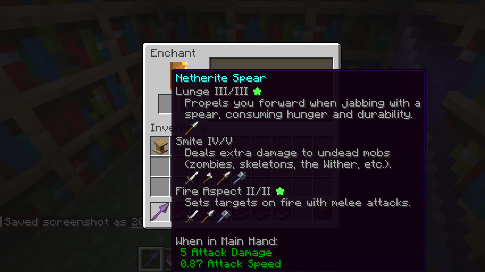

# EML: Enchantments Max Level and Descriptions

<p align="center">
  
</p>

A small client-side Fabric mod for **Minecraft 26.2 and 26.3** that displays enchantment
levels as **current/maximum**:

- Looting I/III
- Sharpness V/V ★
- Mending ★

A green star appears to the right when the current level reaches or exceeds the
defined maximum. Single-level enchantments omit the level number and show only
the star when maximized. Lower levels have no star.

<p align="center">
  
</p>

Each enchantment has a concise description and compact 16x16 native item applicability
icons (such as swords, axes, shields, bows) below its name. When an item has multiple
enchantments, descriptions are hidden by default to keep tooltips compact, and
can be expanded by holding **Shift**. Holding Shift also reveals full textual
applicability lists and extra details (such as which mobs are considered undead).

Icons use Minecraft's inventory item renderer, including special models such as
shields and resource-pack item models. No font overrides or separate icon PNGs
are needed. Items with durability expand into their supported categories rather
than a generic durability symbol. Long lists wrap after 11 icons, and items not
covered by a category render as themselves, including modded items.

The format appears when hovering over enchanted books in villager trade offers,
trade output slots, and inventories. Enchanted equipment uses the same format.
Names, level translations, and vanilla enchantment colors are preserved.
The maximum comes from the enchantment definition, including server-provided
data packs, rather than a hardcoded list. Untranslated maximum levels use numbers.
The maximum is the enchantment's defined cap, not a guarantee that a particular
villager can sell that level. Gameplay and trade prices are unchanged.

## Install

1. Use Minecraft **26.2 or 26.3** with Fabric Loader **0.19.5 or newer** and Java **25 or newer**.
2. Copy `build/libs/eml-1.0.0+26.2.jar` (or `eml-1.0.0+26.3.jar`) into your instance's `mods` folder, replacing any older EML JAR.
3. Restart Minecraft.

A server-side installation is not required.

## Build and run

With a JDK 25 or newer available:

```sh
# Build for Minecraft 26.2 (default)
./gradlew build

# Build for Minecraft 26.3
./gradlew build -Pminecraft_version=26.3
```

The installable mod is `build/libs/eml-1.0.0+<minecraft_version>.jar`; the `-sources.jar` is
for development only.

To compile and launch a test client directly:

```sh
# Launch test client (Minecraft 26.2)
./gradlew runClient

# Launch test client for Minecraft 26.3
./gradlew runClient -Pminecraft_version=26.3
```

## Description translations

Descriptions use the language key `enchantment.<namespace>.<path>.desc`.
Resource packs can override these or provide descriptions for modded and
data-pack enchantments. Enchantments without a translated description keep
their name, level and applicable items without an empty description or raw key.
Descriptions summarize vanilla behavior; they do not analyze effects changed
by server data packs.

## Manual verification

In a creative test world with commands enabled:

```mcfunction
/give @s minecraft:enchanted_book[minecraft:stored_enchantments={"minecraft:looting":1}]
/give @s minecraft:enchanted_book[minecraft:stored_enchantments={"minecraft:sharpness":5}]
/give @s minecraft:enchanted_book[minecraft:stored_enchantments={"minecraft:mending":1}]
/give @s minecraft:enchanted_book[minecraft:stored_enchantments={"minecraft:binding_curse":1}]
/summon minecraft:villager ~ ~ ~ {VillagerData:{profession:"minecraft:librarian",level:2,type:"minecraft:plains"},Offers:{Recipes:[{buy:{id:"minecraft:emerald",count:1},sell:{id:"minecraft:enchanted_book",count:1,components:{"minecraft:stored_enchantments":{"minecraft:looting":1}}},maxUses:999}]}}
```

Hover over the inventory books and the librarian's offered book and output slot.
Check `I/III` without a star, `V/V ★` with a green star, and `Mending ★` without level numbers. Curse
names should remain red while their stars are green. Buy a book and
check its tooltip again. Repeat with the Russian language selected to verify
localized names such as `Добыча I/III`.

Check that each description follows its enchantment without a blank line, is
indented together with the applicable items, and wraps
without widening the tooltip excessively, and switches with the game language.
Also check a book with multiple enchantments and an enchanted tool. Hidden
enchantment tooltips must remain hidden, including their descriptions and
applicable items. Check Boots for Feather Falling, Bow for Power, and Spears for
Lunge. Restrict a data-pack enchantment to a single sword and verify that the
specific sword is listed instead of all Swords.

Verify the shield model in a Mending book tooltip, wrapped rows of applicable
items, and a restricted enchantment that only supports one specific item. Check
with a resource pack that changes item models and with Force Unicode Font enabled.
Icon rows must retain their position below the description and must not appear
when the enchantment component is hidden.
